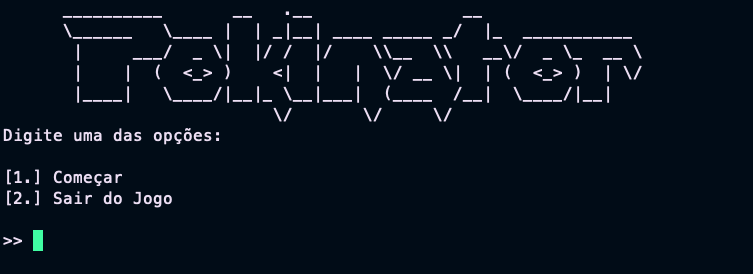
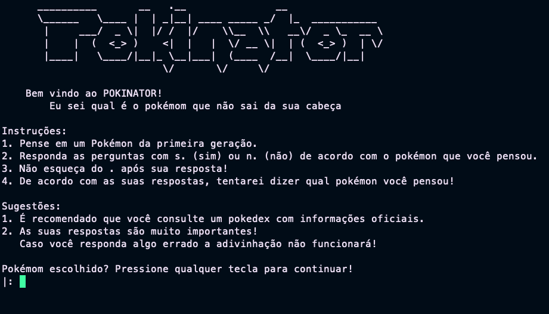
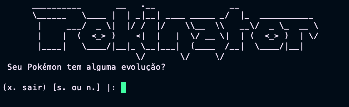
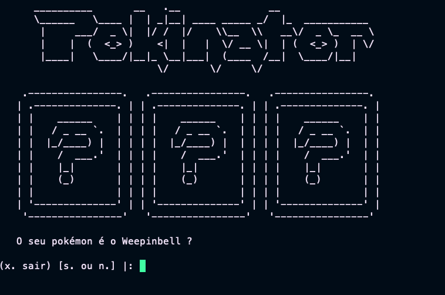
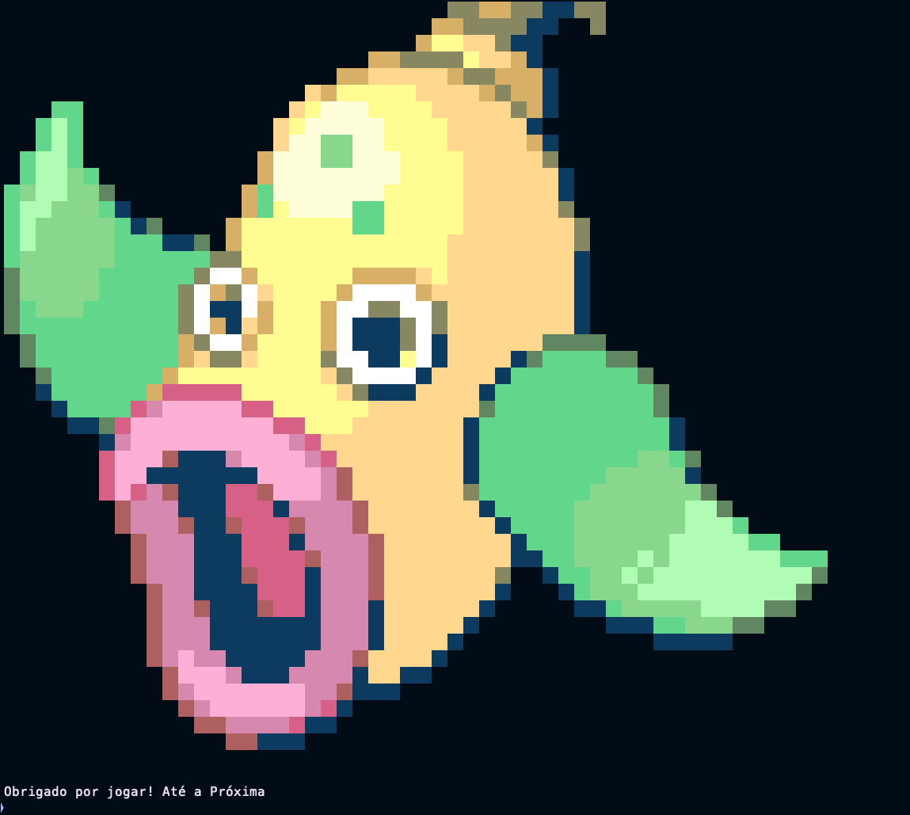

# Pokinator
**Disciplina**: FGA0210 - PARADIGMAS DE PROGRAMAÇÃO - T01  
**Nro do Grupo** : 03 
**Paradigma**: Lógico 

## Alunos
| Matrícula | Aluno |
| :-: | -- |
|18/0030264|Antonio Igor Carvalho|
|18/0098021|Antonio Rangel Chaves|
|18/0149687|Daniel Porto de Souza|
|18/0042238|João Gabriel de Campos de Matos|
|18/0124498|Kess Jhones Gomes Tavares|
|18/0024868|Mateus Moreira Lima|
|18/0132385|Vitor Diniz Pagani Vieira Ribeiro|
|18/0145363|Yan Andrade de Sena|
|18/0078640|Yuri Alves bacarias|

## Sobre 

Pokinator é um jogo que tenta adivinhar em qual Pokemon você está pensando. Utilizando a lógica do jogo [Akinator](https://pt.akinator.com/), o Pokinator faz perguntas sobre as características dos Pokemons e remove os que não condizem com a resposta, até o ponto em que ele adivinhe o Pokemon que o jogador está pensado. 

## Instalação 
**Linguagens**: Prolog 
**Tecnologias**: SWI Prolog 
**Pré-Requisitos**: Ter o [Docker](https://docs.docker.com/engine/install/ubuntu/), make e git instalados.

 - Clonando o repositório:
 Para clonar o reposótorio, basta exucutar o seguinte comando na linha de comando:
 > $ git clone https://github.com/UnBParadigmas2023-1/2023.1_G3_Logico_Pokinator.git
 - Construindo a aplicação:
 Dentro do diretório do reopositório, para construir a a imagem da aplicação, bastar executar o seguinte comando:
 > $ make build
 - Iniciando a aplicação:
 Dentro do diretório do repositório rode o seguinte comando para iniciar aplicação;
 > $ make run
 
 Será aberta a seguinte tela:
 
  
 
## Uso 
A navegabilidade do programa se dá pela linha de comando. As opções disponívei são apresentadas nos menus. É importante se atentar para o ponto ('.') que é necessário ao fim de todo input realizado. Caso seja, digitada uma opção não reconhecida, será mostrada uma tela de erro voltando para a anterior após um tempo.

Ao começar, uma tela de instruções será mostrada, Leia atentamente para obter uma boa utilização da aplicação.

Após ler as instruções, digite qualquer tecla seguido de ponto ('.') e pressione enter para continuar.

Feito isso, será apresentada a tela de perguntas, onde as perguntas serão feitas e respondidas com s, para sim, e n, para não sempre seguidos do ponto. É possível deixar a aplicação a qualquer momento, basta digitar x. e pressionar enter.

Quando o pokinator resolver realizar um chute a seguinte tela aparecerá, mostrando o nome do pokemom que ele acreditar ser o escolhido.

É preciso responder, também, se ele acertou ou não. Caso ele tenha acertado, o sistema vai mostrar uma ilustração do seu Pokémom em FullHD.

Caso ele não consiga adivinhar o Pokémon escolhido, o humilde pokinator ira admitir sua derrota e se retirar em seguida.

## Vídeo

Link de apresentação: https://www.youtube.com/watch?v=GO7ynYJS1d0

## Participações
Apresente, brevemente, como cada membro do grupo contribuiu para o projeto.
|Nome do Membro | Contribuição | Significância da Contribuição para o Projeto (Excelente/Boa/Regular/Ruim/Nula) |
| -- | -- | -- |
| Antonio Igor Carvalho | Criação do módulo de mensagens utilizadas pelo menu, pequena contribuição na planilha de pokemons e suas informações, pequena contribuição na parte de analisar se restam pokemons na base de conhecimento | Regular | 
| Antonio Rangel Chaves | Ajuda na verificação dos pokemons restantes na base de conhecimento depois da respostas das perguntas | Ruim | 
| Daniel Porto de Souza | Cálculo de melhor pergunta, lógica de atualização da base, fluxo da aplicação, ajustes gerais e integração | Excelente | 
| João Gabriel de Campos de Matos | Criação do modulo bc_atualizações, utilizado para atualizar a lista de pokemons com base nas respostas do usuário. | Boa | 
| Kess Jhones Gomes Tavares | Tratamento dos inputs e auxilio no fluxo de resposta final para o úsuario | Regular | 
| Mateus Moreira Lima | Participei na parte de verificação e chute de pokémons da base, quando pokémons com os mesmos parâmetros não era possível chegar a uma única conclusão. | Regular |
| Vitor Diniz Pagani Vieira Ribeiro | Criação da verificação dos pokemons restantes na base de conhecimento depois da respostas das perguntas, e participação da criação da verificação para cada tipo de caso da base resultante. | Regular | 
| Yan Andrade de Sena | Criação das perguntas e também da base de pokémons | Boa | 
| Yuri Alves Bacarias | Contribuição na formação da planilha de pokemons, contruibuição na exclusão dos pokemons e na logica do bancos de dados dos pokemons |  regular | 

## Outros 

### Trabalhos Futuros

Para trabalhos futuros, podemos expandir o mundo do Pokinator, adicionando mais Pokemons de diferentes bases e mais perguntas, para que o Pokinator possa adivinhar mais Pokemons. Além disso, podemos adicionar mais funcionalidades, como a possibilidade de adicionar novos Pokemons e novas perguntas, para que o Pokinator possa ser mais personalizado.

Além disso, podem implementados algoritmos de decisões mais avançados comom o [ID3](https://en.wikipedia.org/wiki/ID3_algorithm#).

### Lições aprendidas

A equipe como um todo nota um impacto muito interessante referenta a mudança de paradigmas. É do sentimento de todos notar, que, após passar pela linguágem Haskell, Prolog se assemelha bem mais com o paradigma funcional em quesitos de estruturação e estilística. Não quebre um código em prolog, ele costuma ser birrento.

Além disso, nuances como a ordem e o sentidos dos dados foram percebidos. Por exemplo: era de senso comum que ao se perguntar sobre um parametro específico, os pokémons que possuisem o mesmo valor questionado deveriam ser excluídos em caso de resposta negativa. Só que para alguns caso, seria mais vantajoso perguntar o contrário, o que geraria a ação contrária e, por conseguinte, casos especiais. Este foi o caso do parametro sobre evoluções dos pokemons, onde se a pergunta for sobre o valor evo, refernte a falta de evoluçao, erá mais vantajoso e claro realizar a pergunta: "O seu pokemon tem alguma evoluçao" ao invé de: "O seu pokemon tem 0 evoluçoes".

### Percepções

O grupo como um todo, percebe que o desenvolvimento contribuiu muito de forma a somar bastante valor no que tange a percepção e fixação dos conteúdos estudados no módulo.
Existe a satisfação em ter realizado mais um projeto interessante conhecendo uma nova forma de abordagem.

### Fragilidades

Logo o que vem a mente dos integrantes é a falta de uma interface gráfica mais amigável, e que a interação direta na lina de comando complica um pouco a utilização. Posto isso, muitas atenção foi dada na apresentação da interface, procurande sempre elucidar bem e ilustrar o que for possível.

Outra fragilidade se dá pela não continuidade de execução, que faz com que o usuário sempre tenha que rodar novamente para jogar. Não foi implementado a funcionalidade de jogar novamente.

Além disso, por ter uma base relativamente grande em termos de pokemons, não foi possível realizar testes para cada pokemon.

**Para mais detalhes e comentários, veja o [vídeo de apresentação](https://www.youtube.com/watch?v=GO7ynYJS1d0)**

## Fontes
> https://docs.docker.com/engine/install/ubuntu/

> https://pt.akinator.com/

> https://github.com/shinya/pokemon-terminal-art/

> https://www.swi-prolog.org/pldoc/doc_for?object=manual

